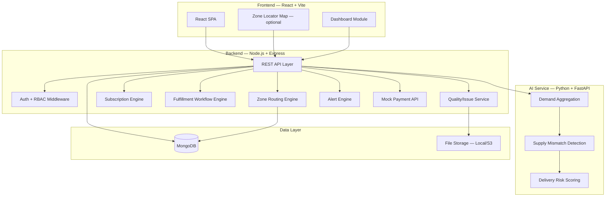
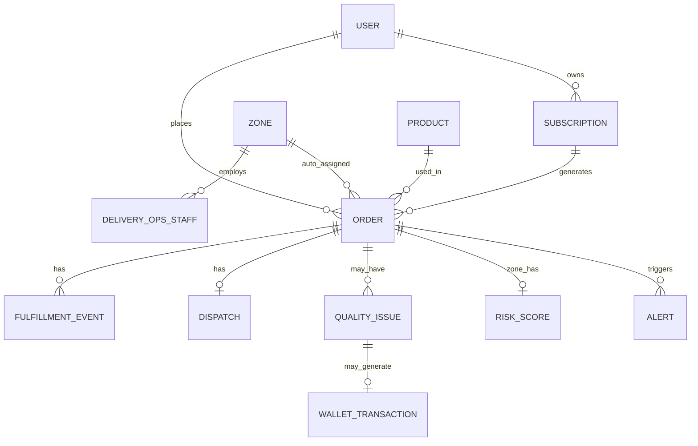
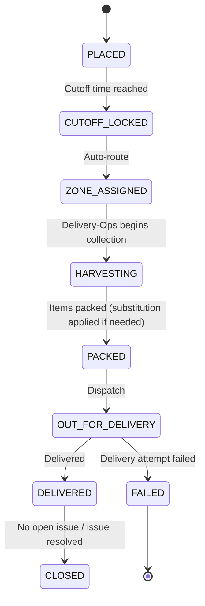
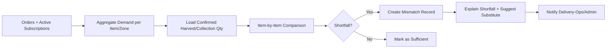

# Phase 0 — Project Analysis & Architecture

## FarmFresh Direct — Farm-to-Doorstep Delivery & Subscription Platform

---

## Repository Status

The repository is assumed **empty or early-stage** — containing only the PRD.md, Build Phases document, Master Build Blueprint, README.md and SETUP.md generated so far. All application code will be built from scratch, phase by phase.

---

## A. Product Architecture

The system is a **modular monolith** with a separate AI microservice. This is the right balance for a prototype — clean separation of concerns without microservice overhead.



### Module Relationships

| Module | Depends On | Provides To |
|--------|-----------|-------------|
| Auth & RBAC | Database | All modules (middleware) |
| Zone Management | Auth | Zone Routing, Dashboard |
| Product Catalog | Auth | Orders, Subscriptions, Dashboard |
| Order Management | Auth, Catalog | Zone Routing, Fulfillment, Dashboard |
| Subscription Engine | Auth, Catalog | Order Management (auto-generates orders), Billing |
| Zone Routing | Zones, Orders | Fulfillment (queue visibility) |
| Fulfillment Workflow | Orders, Zones, Auth | Alerts, Audit |
| Quality/Issue Service | Orders | AI Pipeline (evidence), Wallet, Audit |
| AI Pipeline | Orders, Catalog Stock | Shortfall alerts, Risk scores |
| Dispatch & Delivery | Orders, Fulfillment | Dashboard, Alerts |
| Billing/Wallet | Subscriptions, Quality Issues | Dashboard, Alerts |
| Dashboard | All data modules | Admin views |
| Alerts & Escalation | Workflow, Deadlines, Billing | Notifications |
| Mock Payment API | Billing | Sync verification data |

---

## B. User Roles

| Role | Key | Permissions |
|------|-----|-------------|
| **Customer** | `CUSTOMER` | Browse catalog, place orders, manage own subscriptions, upload quality-issue evidence, track own orders |
| **Delivery-Ops Staff** | `DELIVERY_OPS` | Review zone queue, update fulfillment status, dispatch/deliver orders, resolve quality issues, capture proof of delivery |
| **System Admin** | `ADMIN` | Zone & product catalog management, platform-wide oversight, dashboards, audit trail, system configuration |

### Permission Matrix

| Resource | CUSTOMER | DELIVERY_OPS | ADMIN |
|----------|------|-----------------|-------|
| Products — Create/Edit | ✗ | ✗ | ✓ |
| Products — View | ✓ | ✓ | ✓ |
| Orders — Create | ✓ | ✗ | ✗ |
| Orders — View | Own | Own Zone | All |
| Orders — Reassign Zone | ✗ | ✗ | ✓ |
| Subscriptions — Manage (pause/swap/cancel) | Own | ✗ | View Only |
| Quality Issues — Report | Own | ✗ | ✗ |
| Quality Issues — Resolve | ✗ | Own Zone | View Only |
| Fulfillment — Update Item Status | ✗ | Own Zone | View Only |
| Dispatch — Mark Delivered/Failed | ✗ | Own Zone | View Only |
| Wallet — View | Own | Own Zone | All |
| Zones — CRUD | ✗ | ✗ | ✓ |
| Delivery-Ops Accounts — Create | ✗ | ✗ | ✓ |
| Dashboard — Platform-wide | ✗ | ✗ | ✓ |
| Dashboard — Zone-level | ✗ | Own Zone | ✓ |
| Alerts — Manage | ✗ | Own Zone | ✓ |
| Audit Trail | ✗ | Own Zone | ✓ |

---

## C. Frontend Routes / Pages

```
/                              → Redirect to /dashboard or /login
/login                         → Login page
/register                      → Customer self-registration
/dashboard                     → Role-based dashboard (Customer/Delivery-Ops/Admin)
/catalog                       → Product catalog / "Today's Harvest"
/subscribe                     → New subscription (plan builder)
/checkout                      → One-time order checkout (cutoff-aware)
/orders                        → Order list (own / zone queue / all — role-based)
/orders/:id                    → Order detail
/orders/:id/fulfillment          → Item-level fulfillment / status timeline
/orders/:id/dispatch             → Dispatch status
/subscriptions                 → My subscriptions (Customer)
/subscriptions/:id              → Subscription detail (pause/swap/cancel)
/zones                          → Zone list (Admin)
/zones/new                      → Create zone (Admin only)
/zones/:id                      → Zone detail + performance
/delivery-ops                   → Delivery-Ops accounts (Admin)
/quality-issues                 → Quality-issue management (role-scoped)
/quality-issues/:id              → Issue detail + evidence
/ai/mismatch                    → AI demand/supply mismatch results
/wallet                         → Wallet & billing (Customer)
/alerts                         → Alerts & escalation
/audit                          → Audit trail (Admin/Delivery-Ops)
/profile                        → User profile
/mock-payment                   → Mock payment API demo
```

---

## D. Backend Modules & API Structure

### Module Organization

```
backend/
├── src/
│   ├── config/          → DB, env, constants
│   ├── middleware/       → auth, rbac, error-handler, validation
│   ├── modules/
│   │   ├── auth/         → login, register, JWT, roles
│   │   ├── users/        → user CRUD, profile
│   │   ├── zones/        → zone CRUD, pincode mapping
│   │   ├── deliveryOps/  → delivery-ops account management
│   │   ├── products/     → product catalog CRUD, stock ceilings
│   │   ├── orders/       → order CRUD, routing, queue
│   │   ├── subscriptions/ → subscription CRUD, auto order generation
│   │   ├── fulfillment/  → item-level status transitions, audit
│   │   ├── dispatch/     → dispatch/delivery states, proof of delivery
│   │   ├── qualityIssues/ → upload, resolution, evidence, access
│   │   ├── wallet/        → wallet credits, billing status
│   │   ├── dashboard/    → KPIs, drill-down, analytics
│   │   ├── alerts/       → deadlines, escalation, risk
│   │   └── mock-payment/ → mock payment API
│   ├── utils/            → helpers, date, formatting
│   └── app.js             → Express app setup
├── seeds/                → Synthetic data seeders
└── package.json
```

### REST API Endpoints

#### Auth (`/api/auth`)
| Method | Endpoint | Description |
|--------|----------|-------------|
| POST | `/register` | Customer self-registration |
| POST | `/login` | Login, returns JWT |
| POST | `/logout` | Invalidate token |
| GET | `/me` | Current user + role |

#### Users (`/api/users`)
| Method | Endpoint | Description |
|--------|----------|-------------|
| GET | `/` | List users (admin) |
| GET | `/:id` | User detail |
| PUT | `/:id/profile` | Update profile (address/pincode) |

#### Zones (`/api/zones`)
| Method | Endpoint | Description |
|--------|----------|-------------|
| GET | `/` | List zones |
| POST | `/` | Create zone (admin) |
| GET | `/:id` | Zone detail |
| PUT | `/:id` | Update zone |
| GET | `/:id/performance` | Zone performance summary |
| GET | `/serviceability/:pincode` | Check if a pincode is serviceable |
| POST | `/:id/staff` | Assign a delivery-ops staff member |

#### Products (`/api/products`)
| Method | Endpoint | Description |
|--------|----------|-------------|
| GET | `/` | List catalog (with today's availability) |
| POST | `/` | Create product (admin) |
| GET | `/:id` | Product detail |
| PUT | `/:id` | Update product / stock ceiling |
| PUT | `/:id/availability` | Toggle "Today's Harvest" |

#### Orders (`/api/orders`)
| Method | Endpoint | Description |
|--------|----------|-------------|
| GET | `/` | List orders (filtered by role) |
| POST | `/` | Place order (auto-routes to zone; cutoff-enforced) |
| GET | `/:id` | Order detail (full) |
| PUT | `/:id` | Update order (before cutoff only) |
| DELETE | `/:id` | Cancel order (before cutoff only) |
| GET | `/:id/history` | Order audit history |
| PUT | `/:id/reassign-zone` | Admin manual zone override |
| GET | `/zone/:zoneId` | Orders for a zone |

#### Subscriptions (`/api/subscriptions`)
| Method | Endpoint | Description |
|--------|----------|-------------|
| GET | `/` | List subscriptions (own / all) |
| POST | `/` | Create subscription |
| GET | `/:id` | Subscription detail |
| PUT | `/:id` | Update item list / frequency |
| PUT | `/:id/pause` | Pause / skip next delivery |
| PUT | `/:id/resume` | Resume |
| DELETE | `/:id` | Cancel subscription |
| POST | `/generate-orders` | Scheduled job: generate tonight's orders from active plans |

#### Fulfillment (`/api/fulfillment`)
| Method | Endpoint | Description |
|--------|----------|-------------|
| POST | `/orders/:id/transition` | Harvested/Packed/Substituted/OutOfStock |
| GET | `/orders/:id/audit` | Audit trail for order |
| GET | `/stages` | Available fulfillment stages |

#### Dispatch (`/api/dispatch`)
| Method | Endpoint | Description |
|--------|----------|-------------|
| GET | `/zone/:zoneId` | Tonight's dispatch queue for a zone |
| PUT | `/orders/:id/out-for-delivery` | Mark out for delivery |
| PUT | `/orders/:id/delivered` | Mark delivered (timestamp checked vs 7AM) |
| PUT | `/orders/:id/failed` | Mark failed delivery, with reason |

#### Quality Issues (`/api/quality-issues`)
| Method | Endpoint | Description |
|--------|----------|-------------|
| GET | `/` | List issues |
| POST | `/` | Report issue (with photo upload) |
| GET | `/:id` | Issue detail |
| PUT | `/:id/resolve` | Replace / Refund / Wallet Credit / Reject-claim |
| DELETE | `/:id` | Soft delete |

#### AI (`/api/ai`)
| Method | Endpoint | Description |
|--------|----------|-------------|
| POST | `/aggregate-demand` | Aggregate committed demand per item/zone |
| POST | `/compare-supply` | Compare demand vs confirmed harvest quantity |
| GET | `/mismatches` | List detected shortfalls |
| GET | `/mismatches/:id` | Shortfall detail + suggested substitution |
| POST | `/risk-score/:zoneId` | Calculate delivery-risk score |

#### Wallet (`/api/wallet`)
| Method | Endpoint | Description |
|--------|----------|-------------|
| GET | `/user/:userId` | Wallet balance & history |
| POST | `/credit` | Apply a credit (from issue resolution) |
| POST | `/debit` | Apply against a checkout |

#### Dashboard (`/api/dashboard`)
| Method | Endpoint | Description |
|--------|----------|-------------|
| GET | `/platform` | Platform-wide KPIs (admin) |
| GET | `/zone/:zoneId` | Zone-level KPIs |
| GET | `/overdue` | At-risk/overdue dispatches |
| GET | `/risk` | High-risk zones |

#### Alerts (`/api/alerts`)
| Method | Endpoint | Description |
|--------|----------|-------------|
| GET | `/` | List alerts for user |
| PUT | `/:id/acknowledge` | Acknowledge alert |
| GET | `/escalations` | Escalation queue |

#### Mock Payment API (`/api/mock-payment`)
| Method | Endpoint | Description |
|--------|----------|-------------|
| GET | `/method/:token` | Mock saved-payment-method lookup |
| POST | `/sync` | Sync and validate subscription billing |
| GET | `/sync-log` | Sync history |

---

## E. Database Schema (MongoDB / Mongoose)

Since the project uses **MongoDB**, entities are modeled as Mongoose schemas/collections rather than SQL tables. Reference relationships use `ObjectId` refs; a few small, tightly-coupled sub-documents (e.g. order items) are embedded rather than stored in a separate collection, to keep reads efficient.

### Collection Relationship Overview



### Collection Definitions

#### `users`
| Field | Type | Notes |
|-------|------|-------|
| _id | ObjectId | PK |
| email | String | Unique, indexed |
| passwordHash | String | bcrypt |
| fullName | String | |
| role | String (enum) | `CUSTOMER`, `DELIVERY_OPS`, `ADMIN` |
| phone | String | |
| pincode | String | Used for zone routing |
| address | String | |
| zoneId | ObjectId (ref: `zones`) | Set only for `DELIVERY_OPS` role |
| isActive | Boolean | Default true |
| createdAt / updatedAt | Date | |

#### `zones`
| Field | Type | Notes |
|-------|------|-------|
| _id | ObjectId | PK |
| zoneCode | String | Unique, e.g. `ZN-LKO-01` |
| name | String | |
| city | String | |
| state | String | |
| pincodeRanges | [String] | List/patterns of pincodes served |
| cutoffTime | String | e.g. `21:30` |
| dispatchDeadline | String | e.g. `04:30` (to still make 7 AM) |
| dailyCapacity | Number | Max orders the zone can handle per night |
| location | GeoJSON Point | Optional — `{ type: "Point", coordinates: [lng, lat] }`, `2dsphere` indexed, for the optional zone-locator map |
| staffId | ObjectId (ref: `users`) | Nullable, primary delivery-ops contact |
| isActive | Boolean | Default true |
| createdAt / updatedAt | Date | |

#### `products`
| Field | Type | Notes |
|-------|------|-------|
| _id | ObjectId | PK |
| name | String | e.g. Tomatoes, Full-Cream Milk |
| category | String (enum) | `FRUIT`, `VEGETABLE`, `DAIRY`, `OTHER` |
| unit | String | `kg`, `L`, `piece`, `dozen` |
| price | Number | |
| dailyStockCeiling | Number | |
| isAvailableToday | Boolean | "Today's Harvest" flag |
| substituteProductId | ObjectId (ref: `products`) | Nullable |
| isActive | Boolean | Default true |
| createdAt / updatedAt | Date | |

#### `orders`
| Field | Type | Notes |
|-------|------|-------|
| _id | ObjectId | PK |
| orderCode | String | Unique, e.g. `FF-2026-08231` |
| userId | ObjectId (ref: `users`) | |
| subscriptionId | ObjectId (ref: `subscriptions`) | Nullable — set if auto-generated |
| items | [SubDocument] | Embedded — see below |
| zoneId | ObjectId (ref: `zones`) | Auto-assigned, nullable until routed |
| deliveryDate | Date | The morning this should arrive by 7 AM |
| currentStage | String (enum) | `PLACED`, `CUTOFF_LOCKED`, `ZONE_ASSIGNED`, `HARVESTING`, `PACKED`, `OUT_FOR_DELIVERY`, `DELIVERED`, `FAILED`, `CLOSED` |
| status | String (enum) | `PENDING`, `IN_PROGRESS`, `COMPLETED`, `FAILED` |
| assignedTo | ObjectId (ref: `users`) | Delivery-Ops staff currently responsible |
| dispatchDeadline | Date | SLA deadline for this order's zone |
| isAtRisk | Boolean | Computed at read-time or via scheduled job |
| remarks | String | Latest remark |
| priority | String (enum) | `LOW`, `MEDIUM`, `HIGH`, `CRITICAL` |
| createdAt / updatedAt | Date | |

**Embedded `items` sub-document:**
| Field | Type | Notes |
|-------|------|-------|
| productId | ObjectId (ref: `products`) | |
| orderedQty | Number | |
| fulfilledQty | Number | May differ after substitution/shortfall |
| deliveredQty | Number | |
| substitutedWith | ObjectId (ref: `products`) | Nullable |

#### `subscriptions`
| Field | Type | Notes |
|-------|------|-------|
| _id | ObjectId | PK |
| userId | ObjectId (ref: `users`) | |
| frequency | String (enum) | `WEEKLY`, `MONTHLY` |
| deliveryDays | [String] | e.g. `["MON","THU"]` |
| items | [SubDocument] | `{ productId, qty }` |
| discountPercent | Number | Tier-based |
| status | String (enum) | `ACTIVE`, `PAUSED`, `CANCELLED` |
| pausedUntil | Date | Nullable |
| nextBillingDate | Date | |
| createdAt / updatedAt | Date | |

#### `fulfillmentevents`
| Field | Type | Notes |
|-------|------|-------|
| _id | ObjectId | PK |
| orderId | ObjectId (ref: `orders`) | Indexed |
| fromStage | String | |
| toStage | String | |
| action | String (enum) | `MARK_HARVESTED`, `MARK_PACKED`, `SUBSTITUTE`, `OUT_OF_STOCK`, `DISPATCH`, `DELIVER`, `FAIL` |
| performedBy | ObjectId (ref: `users`) | |
| remarks | String | |
| createdAt | Date | Audit timestamp |

#### `dispatches`
| Field | Type | Notes |
|-------|------|-------|
| _id | ObjectId | PK |
| orderId | ObjectId (ref: `orders`) | Unique (1:1) |
| status | String (enum) | `NOT_DISPATCHED`, `OUT_FOR_DELIVERY`, `DELIVERED`, `FAILED` |
| dispatchedAt | Date | |
| deliveredAt | Date | Compared against the 7 AM window |
| onTimeBy7AM | Boolean | Computed at delivery |
| proofOfDeliveryPath | String | Optional photo |
| failureReason | String | Nullable |
| createdAt / updatedAt | Date | |

#### `qualityissues`
| Field | Type | Notes |
|-------|------|-------|
| _id | ObjectId | PK |
| issueCode | String | |
| orderId | ObjectId (ref: `orders`) | Indexed |
| productId | ObjectId (ref: `products`) | Nullable — item-specific issue |
| issueType | String (enum) | `SPOILED`, `MISSING`, `WRONG_ITEM`, `OTHER` |
| description | String | |
| evidencePhotoPath | String | |
| reportedBy | ObjectId (ref: `users`) | |
| resolutionStatus | String (enum) | `OPEN`, `UNDER_REVIEW`, `RESOLVED`, `REJECTED` |
| resolutionType | String (enum) | `REPLACE`, `REFUND`, `WALLET_CREDIT`, `REJECTED` |
| resolvedBy | ObjectId (ref: `users`) | Nullable |
| createdAt / updatedAt | Date | |

#### `wallettransactions`
| Field | Type | Notes |
|-------|------|-------|
| _id | ObjectId | PK |
| userId | ObjectId (ref: `users`) | |
| type | String (enum) | `CREDIT`, `DEBIT` |
| amount | Number | |
| source | String (enum) | `ISSUE_RESOLUTION`, `REFERRAL`, `CHECKOUT`, `MANUAL_ADMIN` |
| relatedIssueId | ObjectId (ref: `qualityissues`) | Nullable |
| balanceAfter | Number | |
| createdAt | Date | |

#### `mismatches` (AI demand/supply)
| Field | Type | Notes |
|-------|------|-------|
| _id | ObjectId | PK |
| zoneId | ObjectId (ref: `zones`) | |
| productId | ObjectId (ref: `products`) | |
| deliveryDate | Date | |
| committedDemandQty | Number | Aggregated from orders/subscriptions |
| confirmedSupplyQty | Number | Entered by Delivery-Ops/Farm Coordinator |
| shortfallQty | Number | |
| severity | String (enum) | `LOW`, `MEDIUM`, `HIGH`, `CRITICAL` |
| explanation | String | |
| suggestedSubstituteId | ObjectId (ref: `products`) | Nullable |
| status | String (enum) | `DETECTED`, `UNDER_REVIEW`, `RESOLVED`, `FALSE_POSITIVE` |
| detectedAt | Date | |
| resolvedAt | Date | Nullable |

#### `riskscores`
| Field | Type | Notes |
|-------|------|-------|
| _id | ObjectId | PK |
| zoneId | ObjectId (ref: `zones`) | |
| deliveryDate | Date | |
| score | Number | 0–100 |
| riskLevel | String (enum) | `LOW`, `MEDIUM`, `HIGH`, `CRITICAL` |
| factors | Object (embedded) | Breakdown of contributing factors |
| calculatedAt | Date | |

#### `alerts`
| Field | Type | Notes |
|-------|------|-------|
| _id | ObjectId | PK |
| type | String (enum) | `CUTOFF_APPROACHING`, `DISPATCH_DEADLINE_APPROACHING`, `DISPATCH_DEADLINE_MISSED`, `OVERDUE`, `SUPPLY_SHORTFALL`, `QUALITY_ISSUE`, `RENEWAL_FAILED`, `ESCALATION`, `HIGH_RISK` |
| title | String | |
| message | String | |
| orderId | ObjectId (ref: `orders`) | Nullable |
| targetUserId | ObjectId (ref: `users`) | |
| isRead | Boolean | Default false |
| isAcknowledged | Boolean | Default false |
| priority | String (enum) | `LOW`, `MEDIUM`, `HIGH`, `CRITICAL` |
| createdAt | Date | |
| acknowledgedAt | Date | Nullable |

#### `auditlogs`
| Field | Type | Notes |
|-------|------|-------|
| _id | ObjectId | PK |
| entityType | String | `order`, `subscription`, `zone`, etc. |
| entityId | ObjectId | |
| action | String | `CREATE`, `UPDATE`, `DELETE`, `TRANSITION`, `RESOLVE`, etc. |
| performedBy | ObjectId (ref: `users`) | |
| oldValues | Object | |
| newValues | Object | |
| ipAddress | String | |
| createdAt | Date | |

#### `mockpaymentsynclogs`
| Field | Type | Notes |
|-------|------|-------|
| _id | ObjectId | PK |
| subscriptionId | ObjectId (ref: `subscriptions`) | Nullable |
| orderId | ObjectId (ref: `orders`) | Nullable |
| requestData | Object | |
| responseData | Object | |
| validationResult | String (enum) | `MATCH`, `MISMATCH`, `ERROR` |
| syncedAt | Date | |

### Indexing Notes

- `users.email` — unique index
- `orders.orderCode` — unique index
- `orders.zoneId` + `currentStage` — compound index (Delivery-Ops queue queries)
- `zones.location` — `2dsphere` index (only needed if the optional zone-locator map ships)
- `subscriptions.userId` + `status` — index (fast "my active subscriptions" lookup)
- `mismatches.zoneId` + `deliveryDate` — compound index

---

## F. Zone Routing Data Model

Unlike a GIS-heavy reference project, FarmFresh does not need spatial polygons — zone routing is a simpler **pincode/region → zone mapping** lookup, with an *optional* lightweight map for zone discovery.

### Routing Logic

1. On order placement (or nightly subscription-order generation), read the customer's `pincode`.
2. Look up which `zones.pincodeRanges` entry matches (exact pincode list, prefix match, or region/city match — confirm which granularity you want).
3. Assign `orders.zoneId` and `assignedTo` (that zone's primary delivery-ops staff).
4. If no match is found, leave `zoneId` null and place the order in an **Admin manual-assignment / "not currently serviceable" queue**.
5. Admin can override the assignment at any time via `PUT /api/orders/:id/reassign-zone`.

### Optional: Zone Locator Map

If a visual zone map is wanted (not required for MVP), each `zones` document can carry a GeoJSON `location` point, and MongoDB's native `2dsphere` index supports simple "zones near me" queries:

```js
// Find zones within 15km of a point
db.zones.find({
  location: {
    $near: {
      $geometry: { type: "Point", coordinates: [lng, lat] },
      $maxDistance: 15000
    }
  }
});
```

This is far lighter-weight than a PostGIS polygon/corridor system — FarmFresh only needs points, not shapes.

---

## G. Fulfillment Workflow States & Transitions



### Transition Rules

| From Stage | Allowed Actions | Next Stage |
|------------|-----------------|------------|
| PLACED | Cutoff reached (system) | CUTOFF_LOCKED |
| CUTOFF_LOCKED | Auto-route (system) | ZONE_ASSIGNED |
| ZONE_ASSIGNED | Begin harvest/collection | HARVESTING |
| HARVESTING | Mark packed (with substitution if shortfall) | PACKED |
| PACKED | Dispatch | OUT_FOR_DELIVERY |
| OUT_FOR_DELIVERY | Mark delivered, Mark failed | DELIVERED or FAILED |
| DELIVERED | Close (or open quality issue) | CLOSED |
| FAILED | — | Terminal (reattempt creates a follow-up order) |

### Audit Event Structure
Every transition creates a `fulfillmentevents` document with: `orderId`, `fromStage`, `toStage`, `action`, `performedBy`, `remarks`, `createdAt`.

---

## H. AI Pipeline

### Demand/Supply Mismatch Detection Flow



### Technology

| Component | Technology | Notes |
|-----------|-----------|-------|
| Demand aggregation | Python logic (Pandas) | Sums ordered quantities per item/zone/night |
| Supply input | Manual entry by Delivery-Ops/Farm Coordinator | Confirmed harvest/collection at cutoff |
| Comparison | Python logic | Item-by-item comparison with tolerance |
| Substitution suggestion | Catalog lookup | Uses `products.substituteProductId` |
| Risk scoring | Weighted formula | Based on order volume vs staffing, shortfalls, past lateness, weather |

### Aggregation Fields

| Field | Source | Comparison Logic |
|-------|--------|-------------------|
| Committed Demand Qty | Sum of `orders.items.orderedQty` for the delivery date/zone | — |
| Confirmed Supply Qty | Delivery-Ops/Farm Coordinator entry at cutoff | Exact input |
| Shortfall | `demand - supply`, if positive | Flag when shortfall > 0 |
| Suggested Substitute | `products.substituteProductId` | Only surfaced, never auto-applied |

### Important Constraints
- AI is **decision support only** — never decides which specific customers get substituted, never issues final refund decisions
- Every shortfall includes a human-readable explanation
- Delivery-Ops/Admin must manually apply substitutions and notify customers

---

## I. Dashboard Structure

### Hierarchy

```
PLATFORM DASHBOARD (Admin)
├── Total Orders: X
├── Active Subscriptions: Y
├── Subscription Retention Rate: D%
├── Total Revenue: ₹A
├── Delivered vs Failed: B / C
├── On-Time-by-7AM %: E%
├── Overdue Dispatches: F
├── Open Quality Issues: G
├── High-Risk Zones: H
│
└── Drill Down → ZONE
    └── Drill Down → ORDER
        └── Drill Down → ITEM/EVENT
```

### KPI Cards

| KPI | Source | Drill-down |
|-----|--------|-----------|
| Total Orders | `count(orders)` | Order list |
| Active Subscriptions | `count(subscriptions.status = ACTIVE)` | Subscription list |
| Subscription Retention Rate | `1 - (cancelled / total created in period)` | Subscription list |
| Total Revenue | `sum(orders.amount) + sum(subscription billing)` | Order/billing details |
| Delivered vs Failed | `count(dispatches.status)` grouped | Dispatch list |
| On-Time-by-7AM % | `count(onTimeBy7AM = true) / count(delivered) * 100` | Zone performance |
| Overdue Dispatches | `count(isAtRisk = true)` | Order list |
| Open Quality Issues | `count(qualityissues.resolutionStatus = OPEN)` | Issue list |
| High-Risk Zones | `count(riskscores.riskLevel >= HIGH)` | Risk details |

---

## J. MVP Boundaries

### In Scope (Must Have)

- [x] Role-based authentication (3 roles)
- [x] Zone & Delivery-Ops account management (Admin)
- [x] Product catalog management with stock ceilings (Admin)
- [x] Order placement with cutoff enforcement
- [x] Subscription creation (weekly/monthly) with auto-discount + auto order generation
- [x] Pincode-based zone auto-routing
- [x] Item-level fulfillment tracking (harvested/packed/substituted/out-of-stock)
- [x] AI demand/supply mismatch detection
- [x] Dispatch workflow (out for delivery/delivered/failed, with audit trail)
- [x] Quality-issue reporting & resolution
- [x] Wallet & subscription billing tracking (multi-state)
- [x] Dashboard with drill-down
- [x] Cutoff/dispatch-deadline/renewal alerts
- [x] Audit trail
- [x] Mock payment API
- [x] Delivery-risk scoring

### Out of Scope (Not Building)

- ✗ Microservices architecture (beyond the one AI service)
- ✗ Generic AI chatbot
- ✗ Blockchain
- ✗ Real payment gateway / logistics-partner / cold-chain-IoT integration
- ✗ Complex ML models
- ✗ Zone polygon/territory mapping (only point-based locator, and only if time permits)
- ✗ Production-grade hardening
- ✗ Multi-factor authentication
- ✗ Mobile native apps (responsive web only)
- ✗ Multi-farm marketplace / third-party farmer onboarding

---

## K. Proposed Folder Structure

```
farmfresh-direct/
├── frontend/                    # React + Vite
│   ├── public/
│   │   └── favicon.ico
│   ├── src/
│   │   ├── assets/              # Images, icons
│   │   ├── components/          # Reusable UI components
│   │   │   ├── layout/          # Sidebar, Header, Footer
│   │   │   ├── ui/              # Buttons, Cards, Modals, Tables
│   │   │   ├── forms/           # Form components
│   │   │   ├── charts/          # Chart components
│   │   │   └── map/             # Optional zone-locator map components
│   │   ├── pages/                # Route pages
│   │   │   ├── auth/
│   │   │   ├── dashboard/
│   │   │   ├── catalog/
│   │   │   ├── orders/
│   │   │   ├── subscriptions/
│   │   │   ├── zones/
│   │   │   ├── qualityIssues/
│   │   │   ├── ai/
│   │   │   ├── dispatch/
│   │   │   ├── wallet/
│   │   │   └── alerts/
│   │   ├── contexts/             # React contexts (Auth, Theme)
│   │   ├── hooks/                # Custom hooks
│   │   ├── services/             # API service functions
│   │   ├── utils/                # Helpers
│   │   ├── styles/                # Global CSS
│   │   ├── App.jsx
│   │   ├── Router.jsx
│   │   └── main.jsx
│   ├── index.html
│   ├── vite.config.js
│   └── package.json
│
├── backend/                     # Node.js + Express + MongoDB
│   ├── src/
│   │   ├── config/
│   │   │   ├── database.js
│   │   │   ├── env.js
│   │   │   └── constants.js
│   │   ├── middleware/
│   │   │   ├── auth.js
│   │   │   ├── rbac.js
│   │   │   ├── errorHandler.js
│   │   │   └── validation.js
│   │   ├── modules/
│   │   │   ├── auth/
│   │   │   ├── users/
│   │   │   ├── zones/
│   │   │   ├── deliveryOps/
│   │   │   ├── products/
│   │   │   ├── orders/
│   │   │   ├── subscriptions/
│   │   │   ├── fulfillment/
│   │   │   ├── dispatch/
│   │   │   ├── qualityIssues/
│   │   │   ├── wallet/
│   │   │   ├── dashboard/
│   │   │   ├── alerts/
│   │   │   └── mock-payment/
│   │   ├── utils/
│   │   ├── seeds/
│   │   │   └── seedData.js
│   │   └── app.js
│   ├── uploads/                  # Quality-issue photos, proof of delivery
│   ├── package.json
│   └── .env.example
│
├── ai-service/                   # Python + FastAPI
│   ├── app/
│   │   ├── main.py
│   │   ├── aggregator.py
│   │   ├── comparator.py
│   │   ├── substitution.py
│   │   ├── risk.py
│   │   └── models.py
│   ├── requirements.txt
│   └── Dockerfile
│
├── database/
│   └── seed/                     # Synthetic MongoDB seed data (JS/JSON)
│
├── docker-compose.yml            # MongoDB container
├── .env.example
├── .gitignore
├── README.md
└── SETUP.md
```

---

## L. Development Dependencies

### Frontend
| Package | Purpose |
|---------|---------|
| react, react-dom | UI framework |
| react-router-dom | Routing |
| leaflet, react-leaflet | Optional zone-locator map |
| recharts | Dashboard charts |
| axios | HTTP client |
| date-fns | Date utilities |
| lucide-react | Icons |

### Backend
| Package | Purpose |
|---------|---------|
| express | HTTP framework |
| mongoose | MongoDB ODM |
| bcryptjs | Password hashing |
| jsonwebtoken | JWT tokens |
| multer | File upload |
| cors | CORS middleware |
| dotenv | Environment config |
| uuid | ID generation (for human-readable codes) |
| express-validator | Input validation |
| morgan | HTTP logging |
| node-cron | Scheduled subscription-order generation, cutoff jobs |

### AI Service
| Package | Purpose |
|---------|---------|
| fastapi, uvicorn | API framework |
| pandas | Demand aggregation |
| pydantic | Data validation |
| python-multipart | File upload (issue evidence) |

### Infrastructure
| Tool | Purpose |
|------|---------|
| Docker + docker-compose | MongoDB container |
| MongoDB 7 | Database |

---

## M. Development Roadmap

| Phase | Description | Estimated Effort |
|-------|-------------|-----------------|
| **0** | Architecture & Planning (this document) | ✅ Complete |
| **1** | Foundation: Frontend + Backend + DB + Layout | Medium |
| **2** | Authentication & RBAC | Medium |
| **3** | Delivery Zone & Pincode Management | Medium |
| **4** | Product Catalog Management | Low |
| **5** | Ordering Module | Medium |
| **6** | Subscription Engine | Medium |
| **7** | Dispatch Routing (Auto-Assignment) | Medium |
| **8** | Harvest, Packing & Fulfillment Workflow | High |
| **9** | Quality Guarantee & Refunds | Medium |
| **10** | Notifications & Alerts | Medium |
| **11** | Admin Dashboard & Analytics | High |
| **12** | Audit Logs & Security Hardening | Medium |
| **13** | Mock Payment Integration | Low |
| **14** | Delivery-Ops Mobile/Field Experience | Low (if time permits) |
| **15** | Final Integration & Demo | Medium |

*(Matches the 15-phase Build Instructions document generated earlier.)*

---

## N. Important Assumptions

> [!IMPORTANT]
> These assumptions guide the implementation. Please confirm or correct.

1. **Database**: MongoDB will run via Docker (docker-compose) or MongoDB Atlas.
2. **No TypeScript**: Unless you specifically want TypeScript, I'll use **JavaScript (JSX)** for faster prototype development.
3. **CSS Framework**: I will use **Tailwind CSS** (as referenced in the PRD/blueprint) unless you'd prefer vanilla CSS.
4. **File Storage**: Quality-issue photos and proof-of-delivery images stored locally in `backend/uploads/` for the prototype (not S3).
5. **Synthetic Data**: All demo data (zones, orders, users, catalog) will use fictional but realistic Indian customer/zone data, matching the demo accounts already defined in README.md/SETUP.md.
6. **AI Service**: The Python FastAPI demand/supply comparison service runs as a separate process. It can be simplified to run inline with Node.js if Python setup is problematic.
7. **No Real Payment/Logistics APIs**: All external integrations are clearly labeled as MOCK.
8. **Single Database**: One MongoDB instance/cluster serves all collections.
9. **JWT Authentication**: Stateless JWT tokens, no session store needed.
10. **Demo-Ready**: The prototype prioritizes a convincing end-to-end demo flow (subscribe → order → shortfall detection → dispatch → delivery → quality resolution) over production hardening.
11. **Embedded order items**: Order line items are embedded as a sub-array inside each `orders` document rather than a separate per-item collection, per MongoDB's document-modeling conventions — flag if you'd prefer them normalized instead.

---

## O. Open Questions

> [!WARNING]
> Please clarify these before Phase 1 begins:

1. **Do you have Docker installed**, or would you rather use MongoDB Atlas (no local install)?
2. **TypeScript or JavaScript?** Plain JS is faster for prototyping — which do you prefer?
3. **Tailwind CSS or Vanilla CSS?**
4. **Python available?** The AI service uses Python + FastAPI — is Python already installed on your system?
5. **Node.js version?** Which version of Node.js is installed?
6. **Zone routing granularity**: exact pincode list per zone, pincode-prefix ranges, or city/region name matching?
7. **Optional zone-locator map**: in scope for the MVP demo, or skip it entirely (routing works without any map)?
8. **How is "confirmed harvest quantity" entered?** Manually by a Delivery-Ops/Farm Coordinator each night, or do you want a simple estimate-based default for the demo?

---

## Phase 0 — Summary

### Completed
- Full analysis of the PRD, Build Phases, and Master Build Blueprint documents
- Defined complete product architecture (modular monolith + AI microservice)
- Defined 3 user roles with permission matrix
- Designed 20+ frontend routes
- Designed 45+ REST API endpoints across 13 modules
- Designed 14 MongoDB collections with full field specs (Mongoose-oriented, embedded vs. referenced decisions called out)
- Designed zone-routing data model (pincode mapping + optional geospatial locator)
- Designed 8-stage fulfillment workflow with transition rules
- Designed AI demand/supply mismatch detection pipeline
- Designed dashboard hierarchy with KPI sources
- Defined MVP boundaries (in/out of scope)
- Proposed complete folder structure
- Listed all development dependencies
- Confirmed 15-phase development roadmap (matches earlier Build Instructions doc)

### Next Phase
**Phase 1 — Foundation**: Frontend setup (React+Vite), Backend setup (Node+Express), Database connection (MongoDB), Environment config, Base layout, Design system, Basic routing, Error handling, Basic API structure.

**⏸ STOPPED — Waiting for your instruction to proceed.**
